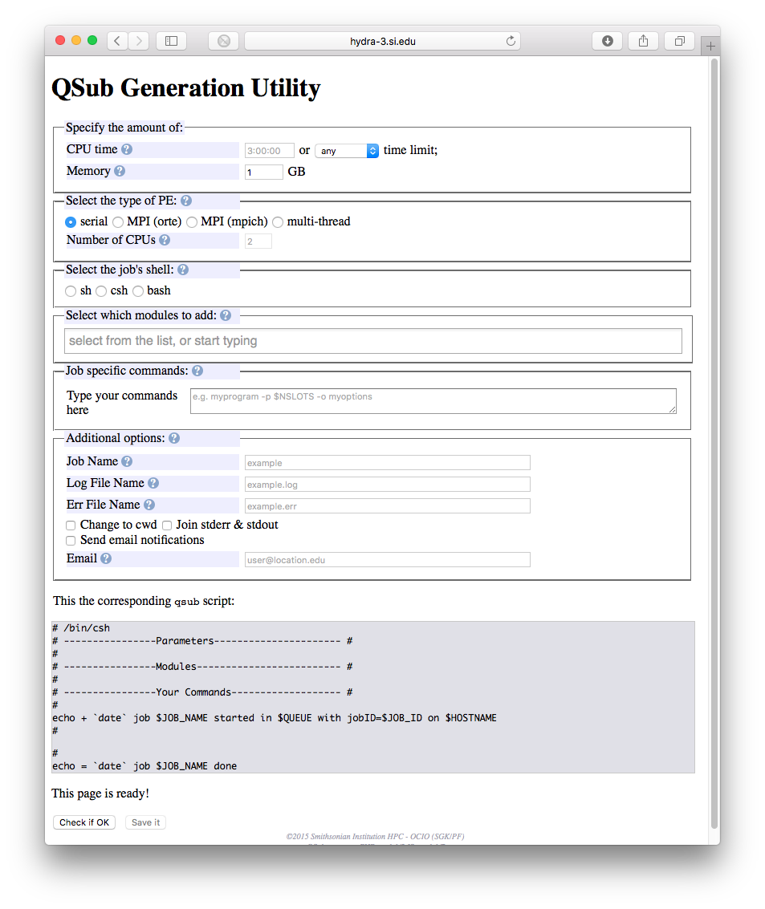

##PartitionFinder tutorial
1. Login to Hydra via `ssh`, e.g. `ssh <username>@hydra-login01.si.edu`
2. Navigate to your `/pool` directory. This will be either `/pool/genomics/<username>` or `/pool/biology/username`. Hint: you can do this with the `cd` command.
3. Copy `/pool/genomics/frandsenp/examples/nucleotide` to your current directory. Hint: remember to copy directories and their contents, you must specify a recursive copy with `cp -r`.
4. Enter the nucleotide directory, `cd nucleotide`.
5. Check to make sure that the directory contains a `partition_finder.cfg` file and an alignment file called `test.phy`.
6. Take a look at the PartitionFinder config file (`partition_finder.cfg`).
7. Examine each variable in the config file. Ensure that the alignment name given matches the alignment in the directory `test.phy`.
8. If you have questions about any of the variables, read the PartitionFinder manual. In fact, if you haven't read the PartitionFinder manual, you should read it regardless. It's really good.
9. Open the [Hydra QSubGen web app](https://hydra-3.si.edu/tools/QSubGen) (only accessible from the SI network). 
10. Select a 'short' time limit from the dropdown.
11. Leave memory at the default (1 GB)
12. Select 'multi-thread' for PE type and enter 4 for the number of CPUs.
13. Start typing 'partitionfinder' into the module field and available modules should appear in a list automatically. Select `bioinformatics/partitionfinder/2.0pr13`
14. In the command section, we will be entering the PartitionFinder command. Note that for use on Hydra, you must call the `PartitionFinder.py` executable directly. This contradicts the manual, which instructs you to call `python` first, e.g. `python PartitionFinder.py <commands>`. In this example, you will submit the job from the directory containing the `nucleotide` directory and you will use RAxML to estimate the likelihoods. ⚠️ _Important:_ When using PartitionFinder on Hydra, you must always specify the `-p` flag in your command. This command specifies the number of processors. You should always set it to `-p $NSLOTS`. This will ensure that PartitionFinder uses only the number of processors that you have reserved via `qsub` ⚠️
15. With the recommendations from number 14 in mind, enter `PartitionFinder.py nucleotide --raxml -p $NSLOTS` into the command field.
16. Next choose an informative job name, such as `PF_nt_tutorial`.
17. Select `-cwd` to run the job from your **current working directory**
18. Return to your `ssh` session and change directory into the directory containing the `nucleotide` directory with `cd ..`.
19. Go back to your web browser and click on the `Check if OK` button to ensure that your script is ok.
20. Either download your script, or copy and paste it straight into your favorite text editor on Hydra, e.g. `nano` or `vi`.
21. Save your job file as `pf_nuc.job`.
22. If you downloaded your script, upload it to your `/pool/genomics/<username>` or `/pool/biology/<username>` directory with `scp`.
23. Submit your job to the scheduler by issuing the command `qsub pf_nuc.job`.
24. You can check on your job status with `qstat -u <username>`.
25. Once your job completes, you should have a new directory in your `nucleotide` directory called `analysis`. Navigate to that directory.
26. The information for the best partitioning scheme will be written to the `best_scheme.txt` file. Look at with `less best_scheme.txt`.
27. 👏 Congratulations, you have now successfully run PartitionFinder on Hydra! 👏