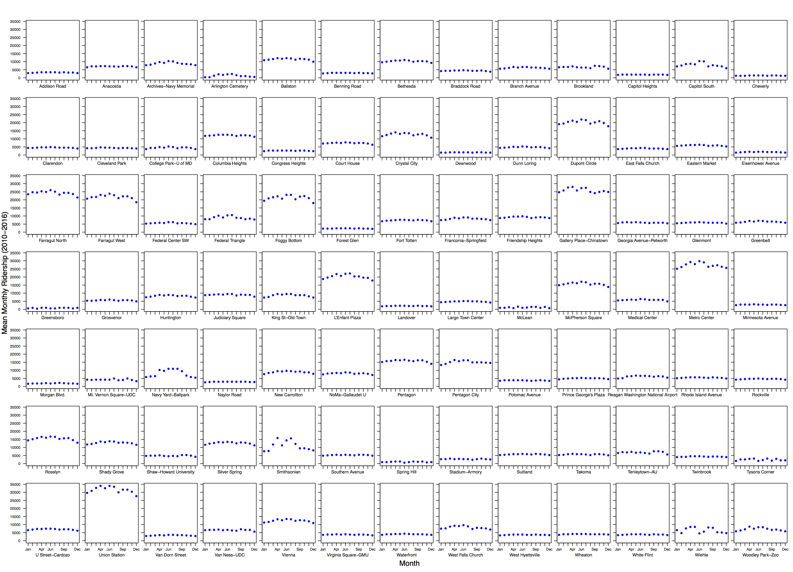
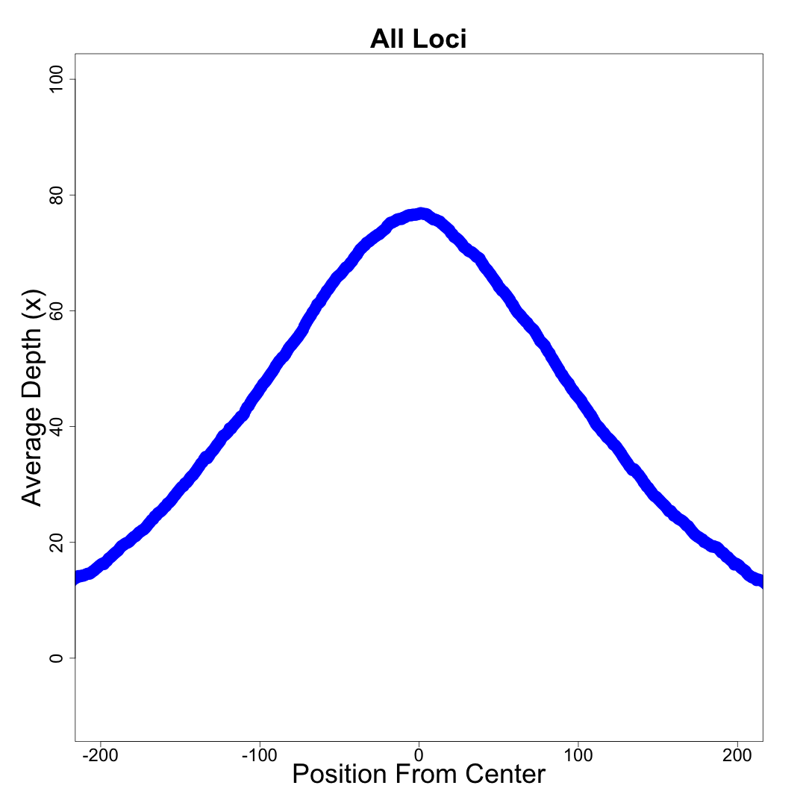

Loops, files manipulations and repetitive tasks, and more!
========================================================
author: Michael Lloyd
date:  Nov 10 2016
autosize: true

Smithsonian Peer-led Bioinformatics Series  
https://github.com/SmithsonianWorkshops/Peer-Led-Bioinformatics/tree/master/Fall2016

<center></center>


What are loops?
========================================================
<center></center>

<center>Multi-step iteration over something.</center>
<center>That something can be a list, a data frame...most any R object type.</center>


Types of loops
====
incremental: true
* For loop  
  + For a set of things, do something  
* While loop  
  + While a condition is true, do something
* Repeat
  + Keep doing something until a 'break' command is given
* Functions that are actually 'hidden' loops
  + The 'apply' family of functions. 
  + Won't be covering these, but see: https://www.datacamp.com/community/tutorials/r-tutorial-apply-family

Basic 'for' loop
=====
incremental: true
For a set of things, do something.

```r
samples <- (1:10)
samples
```

```
 [1]  1  2  3  4  5  6  7  8  9 10
```

```r
for(i in samples) {
  print(i)
}
```

```
[1] 1
[1] 2
[1] 3
[1] 4
[1] 5
[1] 6
[1] 7
[1] 8
[1] 9
[1] 10
```

Brief detour to 'if/else' statements
====
incremental: true
Useful control structures when dealing with loops. 


```r
samples <- 1:10
for (i in samples) {
  if (i %% 2 != 0) 
    next
  else 
    print(i)
}
```

```
[1] 2
[1] 4
[1] 6
[1] 8
[1] 10
```

Basic 'while' loop
====
incremental: true
While a condition is true, do something.

```r
samples <- 1:10
samples
```

```
 [1]  1  2  3  4  5  6  7  8  9 10
```

```r
i<-1
while(i<5) {
  print(samples[i])
  i<-i+1
}
```

```
[1] 1
[1] 2
[1] 3
[1] 4
```


Basic 'repeat' statment
====
incremental: true
Keep doing something until a 'break' command is given.

```r
total <- 0
repeat { 
  total <- total + 1
  print(total)
  if (total > 6)
    break 
}
```

```
[1] 1
[1] 2
[1] 3
[1] 4
[1] 5
[1] 6
[1] 7
```

    Without the 'break' statement, the repeat will loop to infinity breaking the internet.  
    Not really...but seriously, without the break statement R will hang, so always 'break' your repeat loops.


Practical Uses of Loops!
====================================
type: section
Yes, there are good uses of these beyond counting numbers up and down.


Repetative Graphics
====
incremental: true
##### Problem- I need a ton of sub-plots in a figure, and I am really lazy and don't want to write all the 'plot' statements.  
##### Solution- ._._.  
### You guessed it! LOOPS

Repetative Graphics
====
incremental:true
Lets look at some code:

```r
library(readxl)
mydata <- read_excel("example_files/Avg-Weekday-Rail-Ridership-by-Month-by-Station-2010-to-20161.xlsx")

mydata$year <- substr(mydata$DATEMONTHINT, 1, 4)
mydata$month <- substr(mydata$DATEMONTHINT, 5, 7)
mydata <- mydata[order(mydata$year),]

head(mydata)
```

```
  DATEMONTHINT                STATION RIDERS_PER_WEEKDAY year month
1       201009           Addison Road             3667.3 2010    09
2       201009              Anacostia             7290.0 2010    09
3       201009 Archives-Navy Memorial             9094.8 2010    09
4       201009     Arlington Cemetery             1110.9 2010    09
5       201009               Ballston            12146.5 2010    09
6       201009           Benning Road             3150.8 2010    09
```

====

```r
library(doBy)

summed.station <- summaryBy(RIDERS_PER_WEEKDAY ~ STATION + month, data = mydata, FUN = function(x) { c(m = mean(x), sd = sd(x), s = sum(x), len=length(x)) } )

lab<-c("Jan", "Feb", "Mar", "Apr", "May", "Jun", "Jul", "Aug", "Sep", "Oct", "Nov", "Dec")

for ( i in levels(factor(summed.station$STATION)) ) {
  
	summed_single <- summed.station[ which(summed.station$STATION==i), ]
	
	plot(summed_single$month, summed_single$RIDERS_PER_WEEKDAY.m, pch=16)

}
```
<br>
    
    This is a highly condensed version of the code. The full version of the code with detailed graphics code and how I did selective labeling/axes is on GitHub (First_Plot_Code.r).  


So what does the plot look like when it's done? 
===
<center></center>


Now that we can walk lets try running, and look at nested loops...
===
Nested loops


```r
years <- levels(factor(mydata$year))

for (j in years) {
  
  newdata <- mydata[ which(mydata$year==j), ]
  
  summed.station <- summaryBy(RIDERS_PER_WEEKDAY ~ STATION + month, data = newdata, FUN = function(x) { c(m = mean(x), sd = sd(x), s = sum(x), len=length(x)) } )
  
  pdf(paste(j,".pdf", sep=""), height=13,width=18)
  
  for ( i in levels(factor(summed.station$STATION)) ) {
  
    summed_single <- summed.station[ which(summed.station$STATION==i), ]
    
    plot(summed_single$month, summed_single$RIDERS_PER_WEEKDAY.m)
  
  }
  dev.off()
  # 
}
```
    Again, this is condensed code. Full version is on GitHub (Second_Plot_Code.r).
    
So what does it looks when you run the full code? 
===
incremental:true
Lets see.


```r
files <- list.files("Plot_Example", pattern = '.pdf')
files
```

```
[1] "2010.pdf"              "2011.pdf"              "2012.pdf"             
[4] "2013.pdf"              "2014.pdf"              "2015.pdf"             
[7] "2016.pdf"              "WMATA_total_month.pdf"
```


Here's an example plot...
===
<center></center>


Repetative file/data maniuplation 
====
incremental: true
##### Problem- I have a bunch of next-gen sequencing coverage files for different samples, and I need to analyze the contents of all of them at once.   
##### Solution- ._._.  
### You guessed it! LOOPS


Time for more code! 
===
incremental:true


```r
library(hexbin)
library(data.table)
library(doBy)
library(lattice)
library(gridExtra)

setwd("./example_files")
#set directory to location of output folder

files <- list.files(pattern = 'smds.per.base.coverage')
files
```

```
[1] "NACYPHO174-smds.per.base.coverage" "NACYPHO177-smds.per.base.coverage"
[3] "NACYPHO179-smds.per.base.coverage"
```

```r
example_file <- read.table(files[1], header=F, sep="\t")
head(example_file)
```

```
                V1 V2 V3
1 uce10_NACYPHO174  1  2
2 uce10_NACYPHO174  2  3
3 uce10_NACYPHO174  3  3
4 uce10_NACYPHO174  4  3
5 uce10_NACYPHO174  5  3
6 uce10_NACYPHO174  6  3
```

```r
#V1 - name of target, V2 base position, V3 sequencing depth. 
```

Time for more code! 
===
incremental:true


```r
temp_data <- function(file) {
  temp_dataset <- read.table(file, header=F, sep="\t")

  temp_dataset$loc = as.character(lapply(strsplit(as.character(temp_dataset$V1), split="_"), "[", -2))

  dt <- data.table(temp_dataset)

  temp_dataset <- dt[X, list(taxon, V1, V2, V3, loc, trPos=floor(V2-(MED/2)))]

  return(temp_dataset)
}
```

    A condensed example of the actual function used to process each datafile. See GitHub for the full file (Third_Code.r). 
  


Time for more code! 
===
incremental:true


```r
make_dataset <- function(working_dir) {
  setwd(working_dir)
  files <- list.files(pattern = 'smds.per.base.coverage')

  for (file in files){
 
    if (exists("dataset")){
      Sys.sleep(0.1)
      print(file)
      flush.console() 

      temp_dataset <- temp_data(file)

      dataset<-rbind(dataset, temp_dataset)

      rm(temp_dataset)

    } else {
      Sys.sleep(0.1)
      print(file)
      flush.console()

      dataset <- temp_data(file)
    }
  }
new_data <- dataset
rm(dataset)
return(new_data)
}

new_data <- make_dataset("./example_files")
```

====

<br>

```r
summary_avg_loci <- summaryBy(V3 ~ trPos, data = new_data, FUN = function(x) { c(m = mean(x), n = length(x)) } )
head(summary_avg_loci)
```

```
   trPos V3.m V3.n
1:  -317  1.0    2
2:  -316  1.0    4
3:  -315  1.0    4
4:  -314  1.5    4
5:  -313  1.5    4
6:  -312  1.5    4
```

```r
summary_avg <- summaryBy(V3 ~ taxon, data = new_data, FUN = function(x) { c(m = mean(x), n = length(x), min=min(x), max=max(x)) } )
head(summary_avg)
```

```
        taxon     V3.m  V3.n V3.min V3.max
1: NACYPHO174 63.34468 48094      0    482
2: NACYPHO177 27.04631 43468      0    142
3: NACYPHO179 32.44040 43229      0    195
```

```r
summary_avg <- summaryBy(V3 ~ taxon+loc, data = new_data, FUN = function(x) { c(m = mean(x), n = length(x), min=min(x), max=max(x)) } )
head(summary_avg)
```

```
        taxon      loc     V3.m V3.n V3.min V3.max
1: NACYPHO174    uce10 38.33406  461      1     84
2: NACYPHO174   uce100 20.98489  397      1     36
3: NACYPHO174 uce10002 37.27294  425      1     69
4: NACYPHO174 uce10004 46.63944  355      1     89
5: NACYPHO174 uce10005 34.55215  489      0     76
6: NACYPHO174 uce10006 60.55976  502      0    149
```


====

<br>

```r
par(oma=c(2,2,2,2), mar=c(4,5,3,2))
plot(summary_avg_loci$V3.m~summary_avg_loci$trPos, xlim=c(-200,200), ylim=c(-10,100), xlab='Position From Center', ylab='Average Depth (x)', main="All Loci", cex=3, cex.lab=3, cex.axis=2, cex.main=3, col='blue', pch=16)
```




Questions...?
=======

